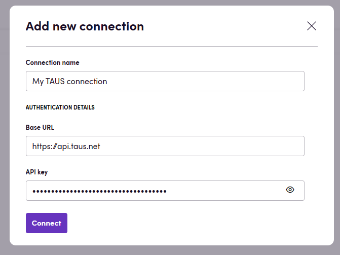

# Blackbird.io TAUS EPIC

Blackbird is the new automation backbone for the language technology industry. Blackbird provides enterprise-scale automation and orchestration with a simple no-code/low-code platform. Blackbird enables ambitious organizations to identify, vet and automate as many processes as possible. Not just localization workflows, but any business and IT process. This repository represents an application that is deployable on Blackbird and usable inside the workflow editor.

## Introduction

<!-- begin docs -->

TAUS EPIC helps users assess the quality of machine-translated content and make informed decisions about its suitability for various purposes.

## Before setting up

Before you can connect you need to make sure that:

- You have a TAUS account.
- You have an API key corresponding to your TAUS account. You can find API keys [here](https://www.taus.net/user/epic-api/keys)

## Connecting

1. Navigate to apps and search for TAUS EPIC.
2. Click _Add Connection_.
3. Name your connection for future reference e.g. 'My TAUS connection'.
4. Fill in the Base URL for your TAUS connection. This is most likely either `https://api.taus.net` or `https://api.sandbox.taus.net`
5. Fill in the API key for your TAUS account.
6. Click _Connect_.

## Actions

### Review

- **Review** review a translated content file returned from other content processing actions. Adds quality scores to each segment.
- **Review text** reviews translated text and returns a quality score

### Editing

- **Edit** a translated file. This action assumes you have previously translated content in Blackbird through any translation action. Only looks at translated segments, first applies an MTQE pass and when the score is below the threshold will do an edit. Remarks about edits are added to segments as notes.
- **Edit text** given a source segment and translated target segment, responds with an edited version of the target segment taking into account typical mistakes.

> Supported languages can be found [here](https://developer.taus.net/). TAUS' sandbox environment only supports :
> - English (en)
> - French (fr)
> - German (de)
> - Italian (it)
> - Spanish (es)

## Feedback

Do you want to use this app or do you have feedback on our implementation? Reach out to us using the [established channels](https://www.blackbird.io/) or create an issue.

<!-- end docs -->
