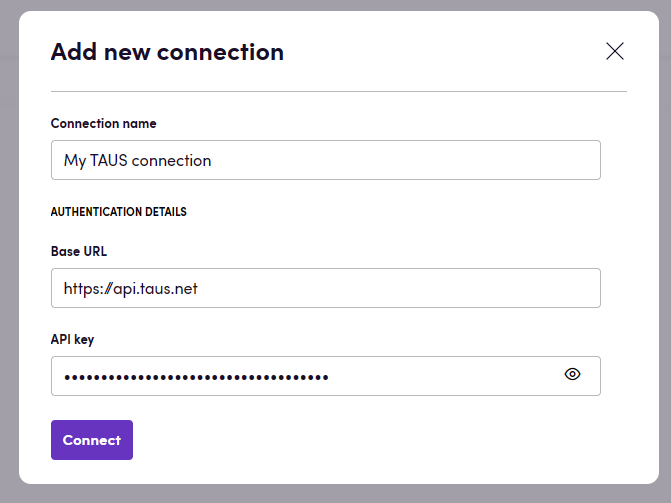

# Blackbird.io TAUS EPIC

Blackbird is the new automation backbone for the language technology industry. Blackbird provides enterprise-scale automation and orchestration with a simple no-code/low-code platform. Blackbird enables ambitious organizations to identify, vet and automate as many processes as possible. Not just localization workflows, but any business and IT process. This repository represents an application that is deployable on Blackbird and usable inside the workflow editor.

## Introduction

<!-- begin docs -->

TAUS EPIC helps users assess the quality of machine-translated content and make informed decisions about its suitability for various purposes.

## Before setting up

Before you can connect you need to make sure that:

- You have a TAUS account.
- You have an API key corresponding to your TAUS account. You can find API keys [here](https://www.taus.net/user/epic-api/keys)

## Connecting

1. Navigate to apps and search for TAUS EPIC.
2. Click _Add Connection_.
3. Name your connection for future reference e.g. 'My TAUS connection'.
4. Fill in the Base URL for your TAUS connection. This is most likely either `https://api.taus.net` or `https://api.sandbox.taus.net`
5. Fill in the API key for your TAUS account.
6. Click _Connect_.

## Actions

### Review

- **Review** Review translated content and output quality scores for each segment. Advanced settings:
  - **Target language**: Override the target language used for quality estimation.
  - **Exclude segment state qualifiers**: Exclude segments that contain the specified state qualifiers.
  - **Output file handling**: Choose the output file format for downstream steps.
- **Review text** Review translated text and output a quality score. Supports the optional metric inputs described below.

### Editing

- **Edit** Edit translated content and output updated segments with quality metadata. Advanced settings:
  - **APE threshold**: Set the upper threshold used for APE processing.
  - **APE low threshold**: Set the lower threshold used for APE processing.
  - **Use RAG**: Enable retrieval-augmented generation during editing.
- **Edit text** Edit translated text and output an improved target text. Supports the optional metric inputs described below.
- **Edit in background** Edit translated content in background jobs and output job IDs for later retrieval. Advanced settings:
  - **Source language**: Override the source language used for job processing.
  - **Segment states to estimate**: Include only units that have segments in the selected states.
  - **Exclude segment state qualifiers**: Exclude segments that contain the specified state qualifiers.
- **Download background files** Download files processed in background jobs and output updated files with usage details. Advanced settings:
  - **State to set above threshold**: Set the segment state applied when the score is above the threshold.

### Metric selection

**Review**, **Review text**, **Edit**, **Edit text**, and **Edit in background** accept two optional free-text inputs:

- **Metric UID**: The metric identifier, including a built-in metric name or a subscriber-specific custom model UUID.
- **Metric version**: The version of that metric as text, such as `3.0.0` or `1`. Requires **Metric UID**.

| Selection | Metric UID | Metric version |
|---|---|---|
| Automatic selection | Leave empty | Leave empty |
| TAUS QE v3 | `taus_qe` | `3.0.0` |
| TAUS QE FR-CA | `taus_qe_frca` | `1` |
| Latest Linguistic QE | `taus_linguistic_qe` | Leave empty |
| Custom model | Model UUID | Version supplied by TAUS |

Leave both inputs empty to retain TAUS's automatic selection: an available custom model for the language pair, or the documented default TAUS QE v2.0.0. Providing a UID without a version selects that metric's latest version for both real-time estimates and background jobs. Surrounding whitespace is trimmed; identifiers and versions retain their casing.

One metric is selected per action invocation and used for every processed segment or background file. Its score is used by the existing threshold and finalization settings. Metric selection can be combined with APE settings. TAUS validates model availability, supported versions, and language compatibility. Linguistic QE currently supports only targets in English or Italian. See the [TAUS Metrics documentation](https://api.taus.net/2.0/estimate/documentation#section/Metrics) and [batch API documentation](https://api.taus.net/2.0/estimate-batch/documentation#section/Metrics).

**Download background files** and **On background job finished** use the metric already selected when each job was created.

## Events

### Batch polling

- **On background job finished** Triggered when all provided jobs reach a terminal status (completed, failed, or expired).

> Supported languages can be found [here](https://developer.taus.net/). TAUS' sandbox environment only supports :
> - English (en)
> - French (fr)
> - German (de)
> - Italian (it)
> - Spanish (es)

## Feedback

Do you want to use this app or do you have feedback on our implementation? Reach out to us using the [established channels](https://www.blackbird.io/) or create an issue.

<!-- end docs -->
